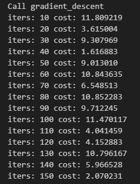
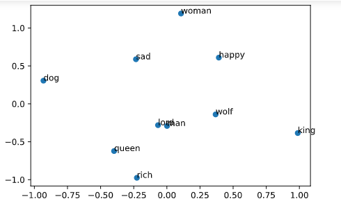
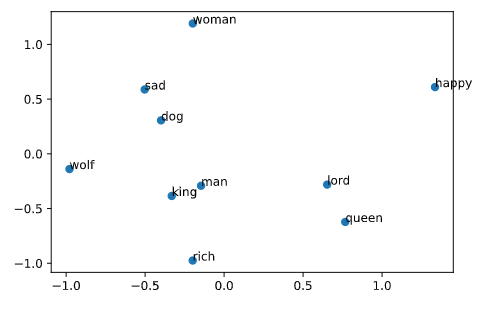

# 🧠 Word Embeddings Extractor (CBOW)


A from-scratch implementation of the **Continuous Bag of Words (CBOW)** model for generating word embeddings. This project constructs a shallow neural network using only **Python and NumPy** to predict center words from context words, demonstrating the fundamental mathematics behind vector space models like Word2Vec.

> **Context:** Developed as part of the DeepLearning.AI Natural Language Processing Specialization (Course 2, Week 4).

---

## 🚀 Key Features

### 1. Neural Network from Scratch
* **No Frameworks:** Implemented forward propagation, cost calculation (Cross-Entropy), and backpropagation manually using NumPy matrix operations.
* **Architecture:** Built the standard CBOW architecture: Input Layer $\rightarrow$ Hidden Layer (Average) $\rightarrow$ Output Layer (Softmax).

### 2. Data Processing Pipeline
* **Sliding Window:** Implemented context extraction logic to generate training pairs (context words $\leftrightarrow$ center word) from raw text corpora.
* **Vocabulary Management:** created mappings for word-to-index and index-to-word translation.

### 3. Dimensionality Reduction
* **PCA Visualization:** Includes a visualization step using Principal Component Analysis (PCA) to project high-dimensional embeddings into 2D space, revealing semantic clusters (e.g., grouping "king" and "queen").

---

## 🛠️ Tech Stack

* **Language:** Python 3.x
* **Core Library:** NumPy (Matrix multiplication, Gradient descent)
* **NLP Tools:** NLTK (Tokenization, Stop-word removal)
* **Visualization:** Matplotlib (PCA plots)

---

## 📊 How It Works (The Math)

The model learns to map words to vectors by minimizing the loss between the predicted center word and the actual center word.

1.  **Forward Prop:** $Z_1 = W_1 \cdot X + b_1$ $\rightarrow$ $H = \text{ReLU}(Z_1)$ $\rightarrow$ $Z_2 = W_2 \cdot H + b_2$ $\rightarrow$ $\hat{y} = \text{softmax}(Z_2)$
2.  **Cost Function:** Categorical Cross-Entropy Loss.
3.  **Back Prop:** Calculation of partial derivatives ($\frac{\partial J}{\partial W_1}$, $\frac{\partial J}{\partial W_2}$) to update weights via Gradient Descent.

---

## 💻 Usage

### Prerequisites
```bash
pip install numpy nltk matplotlib
```

---

## 📊 Results & Visualization

### 1. Training Progress (Cost Reduction)
The model successfully minimizes the cross-entropy loss over iterations, demonstrating that the neural network is effectively learning the context-target word relationships.



### 2. Word Embeddings Visualization (PCA)
After training, we project the high-dimensional word vectors into 2D space using Principal Component Analysis (PCA). As shown below, semantically similar words (like "king" & "queen" or "hostel" & "dorm") cluster together, proving the model has captured semantic meaning.



